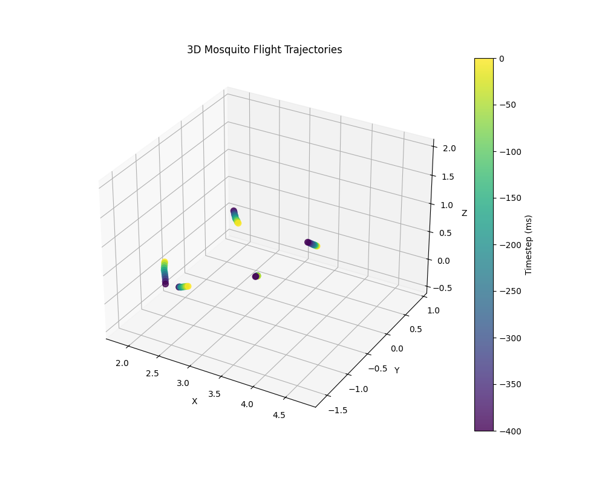
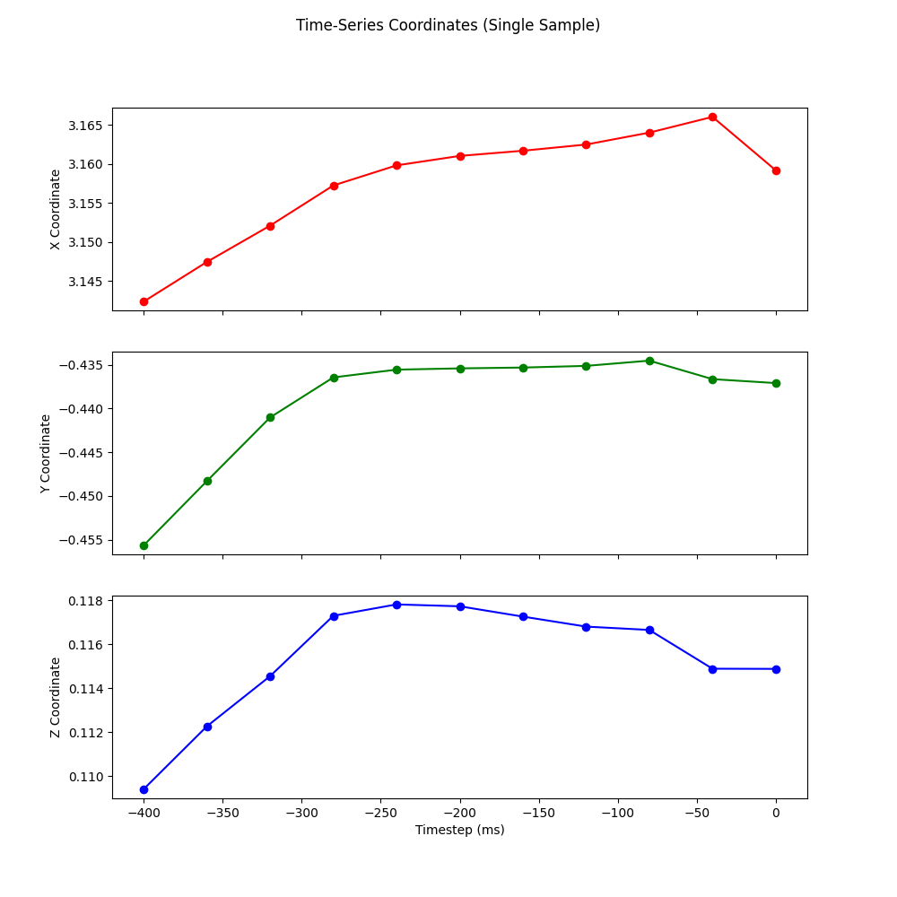
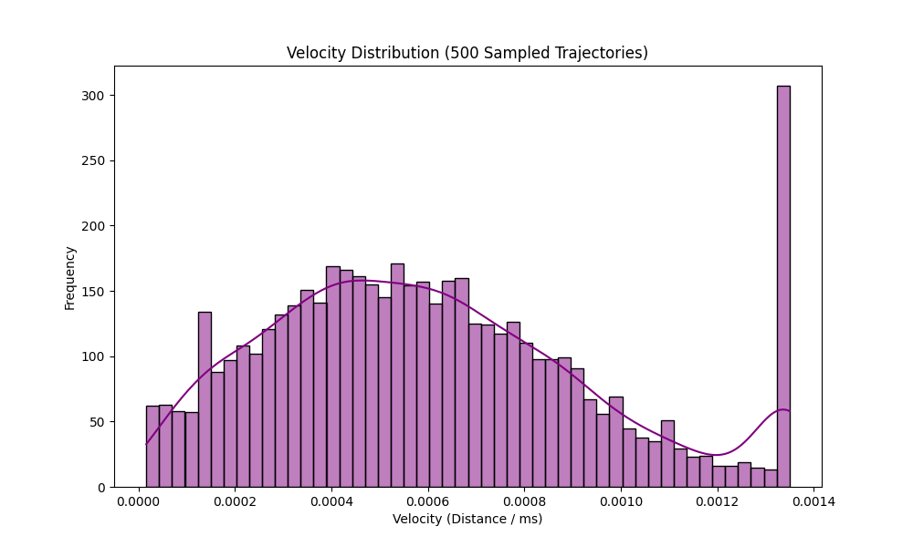

# 🦟 Mosquito Flight Trajectory EDA Report

> [!NOTE]
> 본 리포트는 `skill_trajectory_eda.md`의 파이프라인에 따라 샘플링된 훈련 데이터(`data/train/*.csv`)를 바탕으로 모기의 비행 특성을 시각화한 탐색적 데이터 분석(EDA) 결과입니다.

## 1. 3D Flight Path
5개의 무작위 궤적 샘플을 3차원 공간(X, Y, Z)에 시각화했습니다.
색상의 밝기(Color Gradient)는 시간의 흐름(-400ms ~ 0ms)을 나타내어, 모기의 비행 시작과 끝점을 직관적으로 파악할 수 있습니다.

## 2. Time-Series Coordinate Shift
단일 모기 궤적에 대하여 X, Y, Z 각각의 좌표축이 40ms 단위의 타임스텝에 따라 어떻게 변화하는지 나타내는 2D 시계열 그래프입니다.

## 3. Velocity Distribution
500개의 샘플 궤적에서 추출한 모든 구간별 순간 비행 속도(유클리디안 이동 거리 / 시간)의 히스토그램 및 확률 밀도 함수(KDE)입니다.

---

> [!TIP]
> **모델링 인사이트:**
> 데이터 시각화 결과, 모기의 이동 패턴은 X/Y 축에 비해 Z(수직) 축의 변화가 상대적으로 덜하거나 고유한 주기성을 가지는 경향이 있습니다.
> 각 시점의 절대 좌표 외에도 속도 분포의 꼬리(Outlier Acceleration) 정보 등 역동성을 나타내는 파생 변수를 현재 준비된 LSTM 모델이나 LightGBM의 롤링 피처로 적극 활용하면 높은 예측 성능 향상을 기대할 수 있습니다.
